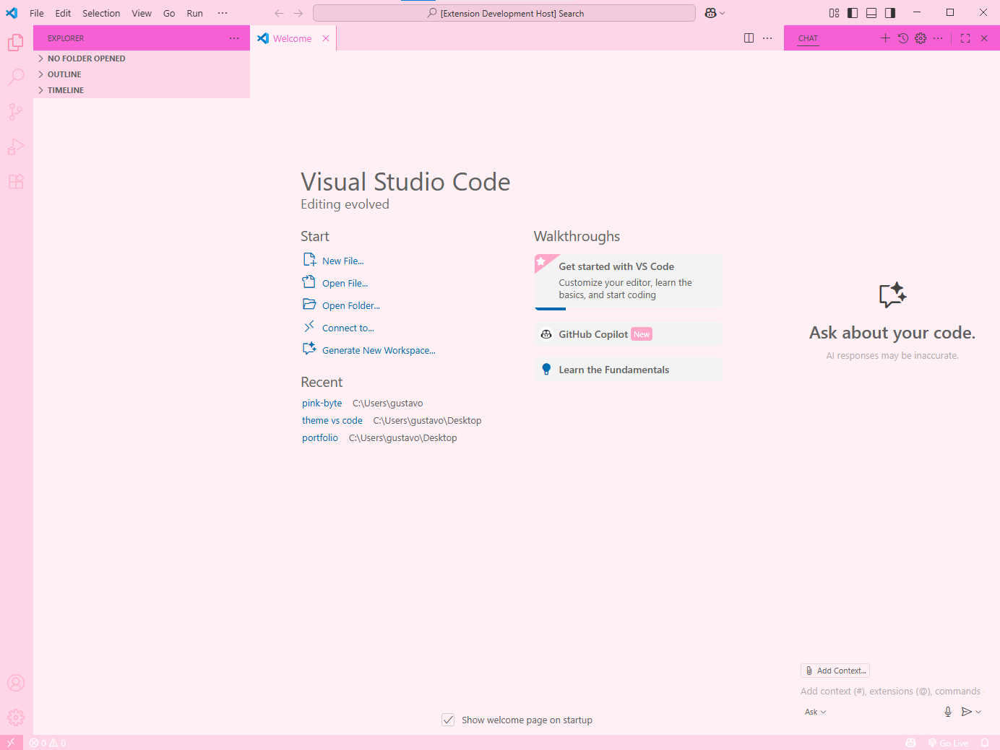
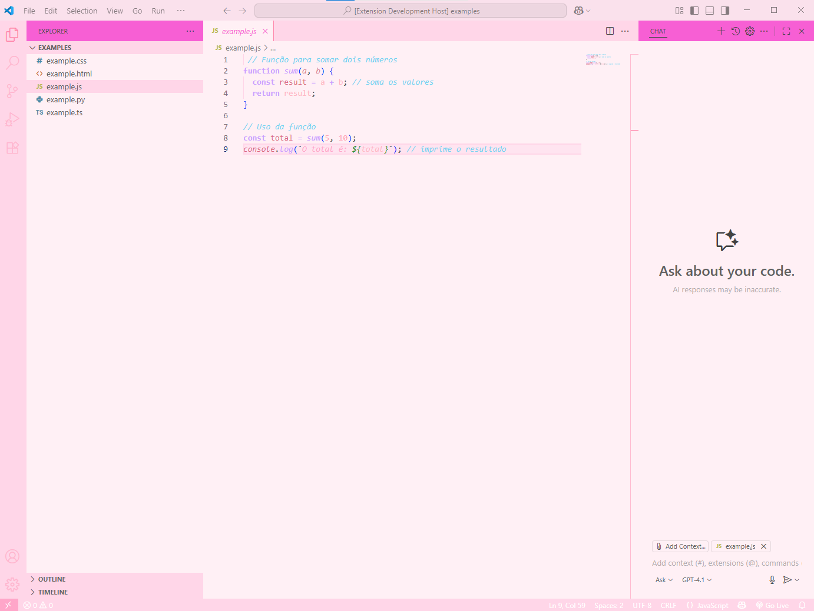
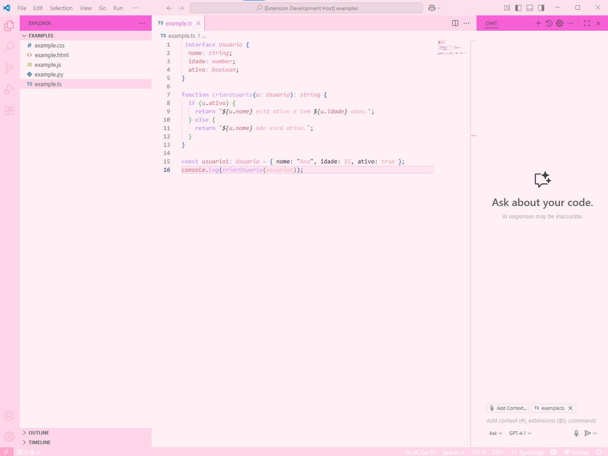
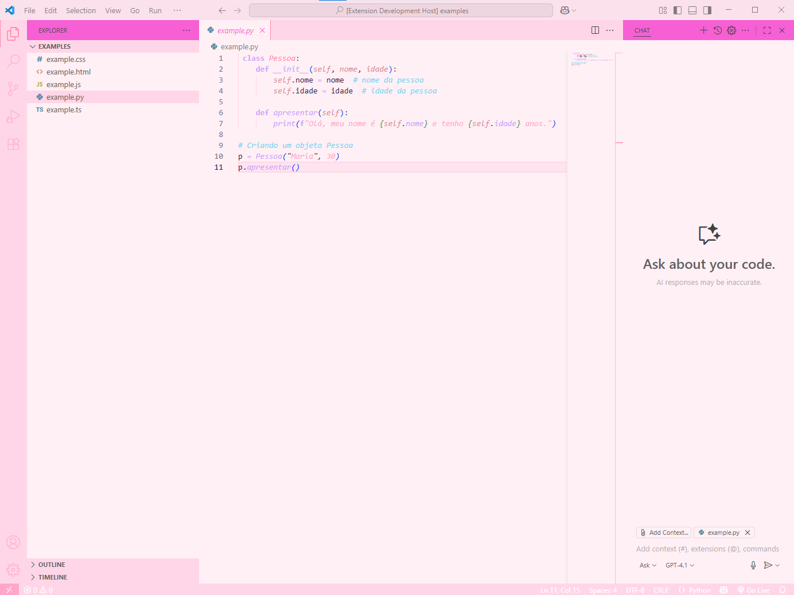
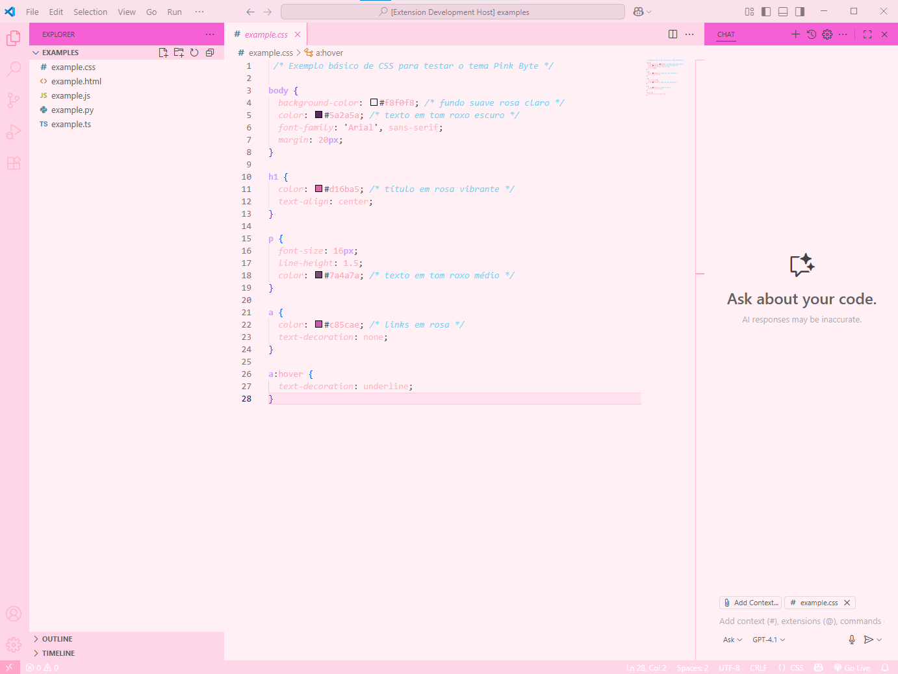

# Pink Byte

> [Versão em Português-Br](README.md)

**Pink Byte** is a soft and delicate color theme for Visual Studio Code, inspired by shades of pink, lilac, and lavender, designed to provide a pleasant, cute, and relaxing coding experience! The main idea is that it won't tire your eyes after hours of coding while still being ideal for those who like a light and soft look, with good readability, contrast, and highlighting for different elements of your code!💖

---

## Features

- Color palette based on light pinks, lilac, and other delicate pastel tones;
- Distinctive highlighting for comments, strings, numbers, functions, types, and keywords;
- Support for highlighting important comments like TODO, FIXME, and NOTE;
- Different styles for errors, warnings, and information to facilitate quick identification;
- Clear and visible differentiation between local variables, parameters, and properties;
- Support for multiple common languages and syntaxes;
- Focus on accessibility with adequate contrast for better readability without compromising your coding experience;

---

## Screenshots

  
*This example shows how the theme looks on the VSCode start screen.*

  
*This example shows how the theme looks applied to JavaScript.*

  
*This example shows how the theme looks applied to TypeScript.*

  
*This example shows how the theme looks applied to Python.*

  
*This example shows how the theme looks applied to HTML.*

  
*This example shows how the theme looks applied to CSS.*

  
*This example shows how the theme looks in the Extensions tab.*

---

## Easy Installation, follow the steps:

### Method 1: Using the extension!

1. Open Visual Studio Code.
2. Go to the Extensions tab (`Ctrl+Shift+X`).
3. Search for **Pink Byte**.
4. Click **Install**.
5. Activate the theme under **File > Preferences > Color Theme > Pink Byte**.

### Method 2: Importing the JSON file!

1. Download the `pink-byte-color-theme.json` file.
2. Install the **Import Theme** extension in VSCode.
3. Use the `Import Theme` command to import the JSON file.
4. Select the **Pink Byte** theme from the theme list.

---

## How to contribute

If you liked the theme and still want to suggest improvements, fix bugs, or add support for more languages, feel free!!  
Here is the step-by-step guide for your contribution:

1. Fork this repository.
2. Create a branch with your feature: `git checkout -b my-feature`.
3. Commit your changes: `git commit -m 'My improvement'`.
4. Push to the remote repository: `git push origin my-feature`.
5. Open a Pull Request.

**ps: your feedback is very important! :)** 

---

## License

This project was developed by Maria Santos and is licensed under the MIT license — see the [English version](LICENSE_EN.md) file for details.

---

## Contact

If you have any questions, want to check out my other projects, talk about Pink-Byte or any other topic:

- 💖 [LinkedIn](https://www.linkedin.com/in/mariah-santos/)  
- 💻 [GitHub](https://github.com/mari4hs)

**Enjoy Pink Byte and the delicacy of coding!💖**